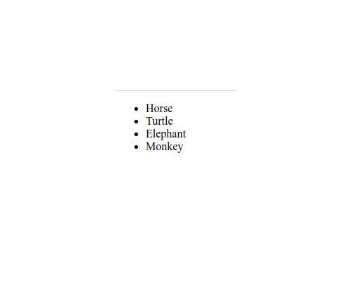

# `05` Mapping array to `<li>`
[](#-results)


Using the knowledge you have from the previous example, now lets fix the map function again but starting from an array of objects.

```js
const animals = [ { label: 'Horse' }, { label: 'Turtle' }, { label: 'Elephan' }, { label: 'Monkey' } ];
```

# :speech_balloon: Instructions

Update the code's [.map function](https://medium.com/poka-techblog/simplify-your-javascript-use-map-reduce-and-filter-bd02c593cc2d) in `src/components/AnimalsInHTML.jsx` to create a new array of `<li>`'s that each correspond to one animal from the original array, the resulting array should be something like this:

```jsx
const animalsInHTML = [
  <li>Horse</li>,
  <li>Turtle</li>,
  <li>Elephant</li>,
  <li>Monkey</li>
];
```

And include them all together inside the website.

#### :bulb: Hint

- You can use the second parameter of the map function as a `key` to uniquely identify each html item.

Your website should look like this: 

[//]: # (autograding info start)
#  Results
> ⌛ Give it a minute. As long as you see the orange dot  on top, CodeBuddy is still processing. Refresh this page to see it's current status.
>
> This is what CodeBuddy found when running your code. It is to show you what you have achieved and to give you hints on how to complete the exercise.


### List from Object Array

|                 Status                  | Check                                                                                    |
| :-------------------------------------: | :--------------------------------------------------------------------------------------- |
|  | `AnimalsInHTML` component should render |
|  | List of animals should be rendered on screen |


[🔬 Results Details](../../actions)
[🐞 Tips on Debugging](https://github.com/DCI-EdTech/autograding-setup/wiki/How-to-work-with-CodeBuddy)
[📢 Report Problem](https://docs.google.com/forms/d/e/1FAIpQLSfS8wPh6bCMTLF2wmjiE5_UhPiOEnubEwwPLN_M8zTCjx5qbg/viewform?usp=pp_url&entry.652569746=SPA-boilerplate-mapping-array-objects)


[//]: # (autograding info end)