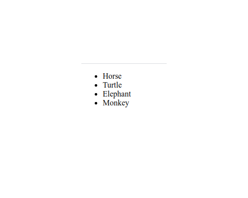

# `05` Mapping array to `<li>`

Mit dem Wissen, das du aus dem vorherigen Beispiel hast, können wir nun die Map-Funktion erneut anwenden, aber ausgehend von einem Array von Objekten.

```js
const animals = [ { label: 'Horse' }, { label: 'Turtle' }, { label: 'Elephan' }, { label: 'Monkey' } ];
```

# :speech_balloon: Anweisungen

Aktualisiere die [.map-Funktion](https://medium.com/poka-techblog/simplify-your-javascript-use-map-reduce-and-filter-bd02c593cc2d) des Codes, um ein neues Array mit `<li>` zu erstellen, das jeweils einem Tier aus dem ursprünglichen Array entspricht. Das resultierende Array sollte etwa so aussehen:

```jsx
const animalsInHTML = [
  <li>Horse</li>,
  <li>Turtle</li>,
  <li>Elephant</li>,
  <li>Monkey</li>
];
```

Und binde sie alle zusammen in die Website ein.

#### :bulb: Hinweis

- Du kannst den zweiten Parameter der map-Funktion als "key" verwenden, um jedes HTML-Element eindeutig zu identifizieren.

Deine Website sollte so aussehen: 

